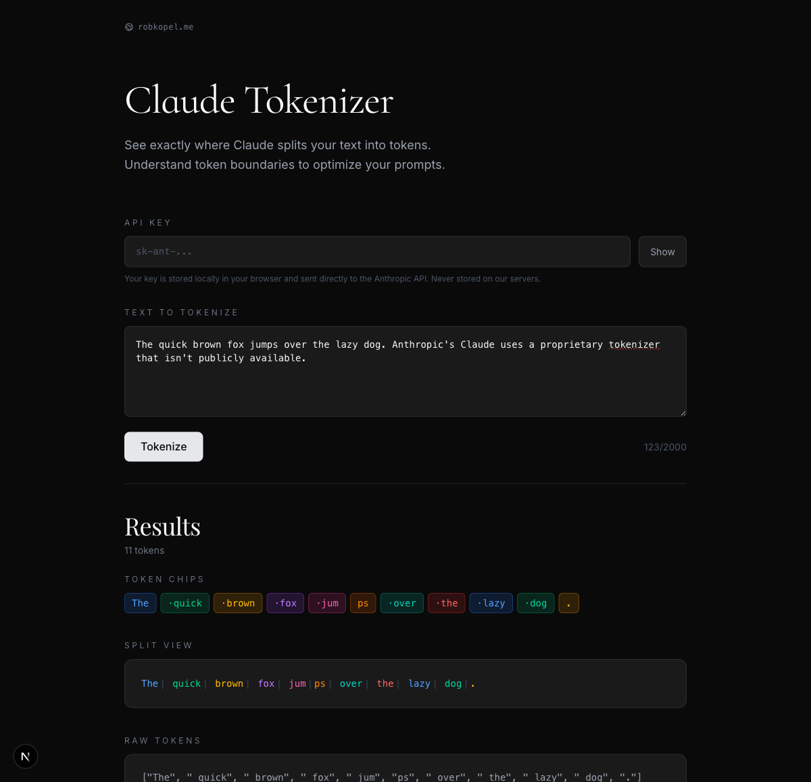

# Claude Tokenizer

Anthropic doesn't expose Claude's tokenizer. You can count tokens via the API, but you can't see *where the splits actually are*. This tool extracts exact token boundaries so you can actually see the splits.



## State of public Claude tokenizing today

- Claude's tokenizer is proprietary — no public vocab file, no downloadable weights
- The API gives you a token **count**, not the actual token **boundaries**
- The [official JS tokenizer](https://github.com/anthropics/anthropic-tokenizer) is only accurate for pre-Claude 3 models

## So how can you tokenize?

There are several obvious approaches. Most of them don't work.

**Streaming chunks ≠ tokens.** You might think each `text_delta` event in a streaming response maps to one token. It doesn't --- Anthropic batches chunks arbitrarily, so you can get multiple tokens in one event or partial tokens split across events.

**Prefill + `max_tokens: 1` breaks.** The natural approach: prefill the assistant response with what you have so far, set `max_tokens: 1`, get the next token. But the API **re-tokenizes your prefill text**, which shifts token boundaries. If the real tokenization produced `["obsc", "urity"]`, your prefill of `"obsc"` might get re-tokenized as `["obs", "c"]`, and the next token comes back wrong.

Note: Additionally with Opus 4.6 Anthropic has disabled prefill entirely, so it can not be leveraged directly. You can still theoritically do prefill in the previous assistant message but it faces the same retokenization challenges.

## How it works

The trick is to never prefill. Instead, increment `max_tokens` on the same prompt:

1. `max_tokens: 1` → `"Security"` (first token)
2. `max_tokens: 2` → `"Security by"` → diff → `" by"` (second token)
3. `max_tokens: 3` → `"Security by obsc"` → diff → `" obsc"` (third token)
4. Keep going until the full text is reproduced

With `temperature: 0` for determinism, the output is largely stable across calls --- each response is a prefix of the next, so diffing gives you exact token boundaries without any prefill re-tokenization issues.

Note: This is ovbiosuly very expensive (t^2 pricing) and purpsefully ignores the optimisation of prefilling incrementally. The focus is on correctness ignorant of cost and it's intended use is for short phrases or words to poke at Claude's tokenizer

## What's in here

- **CLI** (`cli/`) — pipe text in, get token boundaries out
- **Web app** (`web/`) — Next.js app with live streaming results, bring your own API key

## Setup

```bash
# Shared: put your key in .env at the repo root
echo "ANTHROPIC_API_KEY=sk-ant-..." > .env

# CLI
cd cli
npm install
npm run tokenize -- "your text here"

# Web app
cd web
npm install
npm run dev
```

## Hidden tokens — Claude has invisible tokens

While building this, we found something unexpected: Claude's tokenizer has **hidden tokens that consume `max_tokens` budget but produce no visible text**. We've identified them in at least two cases:

### Caps-shift markers

Every standalone ALL CAPS word **after the first** gets a hidden token before it:

| Input | Visible tokens | Hidden | Splits |
|-------|---------------|--------|--------|
| `Hello World` | 2 | 0 | `[Hello][ World]` |
| `HELLO WORLD` | 2 | 1 | `[HELLO][+1h][ WORLD]` |
| `ALL CAPS SENTENCE HERE` | 4 | 2 | `[ALL][+1h][ CAPS][+1h][ SENTENCE][ HERE]` |
| `in Arctic land` | 3 | 0 | `[in][ Arctic][ land]` |
| `in ARCTIC land` | 3 | 1 | `[in][+1h][ ARCTIC][ land]` |

- Title case (`Arctic`) never triggers it
- When caps letters are glued to lowercase (`aARCTIC`), the word fragments into characters instead — `[a][AR][C][T][IC]` with no hidden token
- Looks like a **caps-shift marker** — the tokenizer stores uppercase words as lowercase equivalents + a hidden prefix token

### Whitespace / formatting markers

Leading and trailing whitespace also produces hidden tokens:

| Input | Visible tokens | Hidden | Splits |
|-------|---------------|--------|--------|
| `Hello World` | 2 | 0 | `[Hello][ World]` |
| ` Hello World` (leading space) | 2 | 2 | `[Hello][ World]` |
| `ARCTIC ` (trailing space) | 1 | 2 | `[ARCTIC]` |

The model can't reproduce the leading/trailing whitespace, but the hidden tokens are real (`stop_reason: "max_tokens"`). These may be whitespace-handling or formatting control tokens.

### XML close-tag markers

Opening tags get no hidden token, but closing tags do:

| Input | Visible tokens | Hidden | Splits |
|-------|---------------|--------|--------|
| `...<system>IT IS BOILING</system>` | 13 | 2 | `...[<system][>]...[+1h][</system][>]` |

The closing tag `</system` gets a hidden token but the opening tag `<system` doesn't. The tokenizer likely stores close tags as the same token as their open tag with a hidden "close" prefix — saving vocabulary space.

Full test results in [`test-results.md`](test-results.md).

## Caveats

- One API call per token — this is a debugging tool, not a production service
- The model doesn't always perfectly reproduce long or complex text
- `temperature: 0` determinism is very good but not guaranteed across API versions
- ALL CAPS text costs extra hidden tokens (see above)
